# Tertia

**Find the trio. Train your eye. Build a streak.**

[Available on the App Store →](https://apps.apple.com/us/app/tertia/id6764515108)

Love games like **Set**? Tertia is a fast, focused pattern-matching card game built for iPhone and iPad — the same brain-tickling "are they all the same or all different?" puzzle, dressed up with combos, a daily challenge, and a learn-by-playing mode that explains every wrong answer. Easy to learn, fiendish to play under a clock.

---

## Screenshots

### iPhone

| Choose Mode | In-game | Stats |
| :---------: | :-----: | :---: |
| 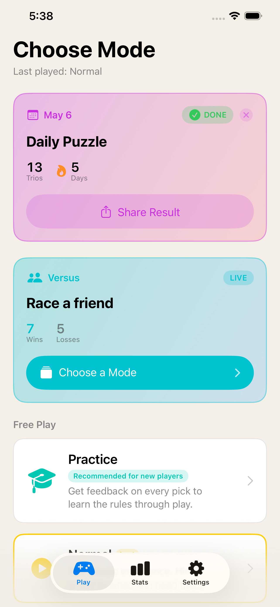 | 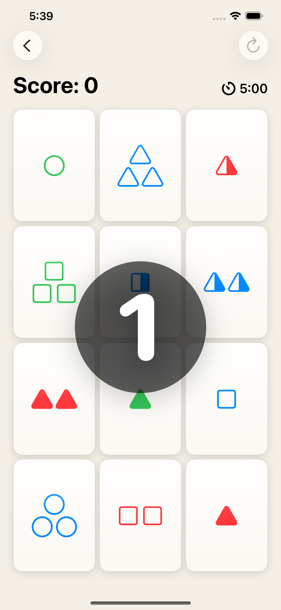 | 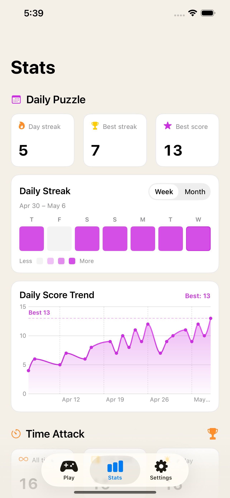 |

| Versus Picker | First to 10 | Settings |
| :-----------: | :---------: | :------: |
| 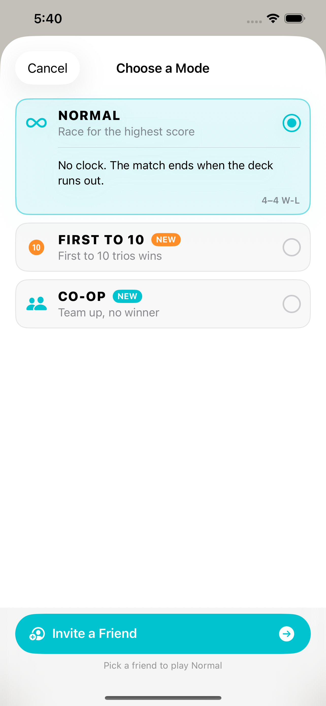 | 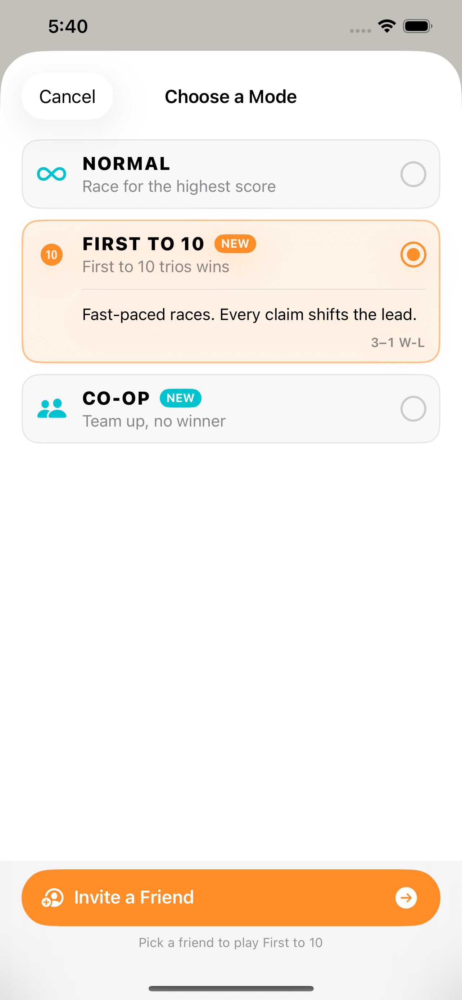 | 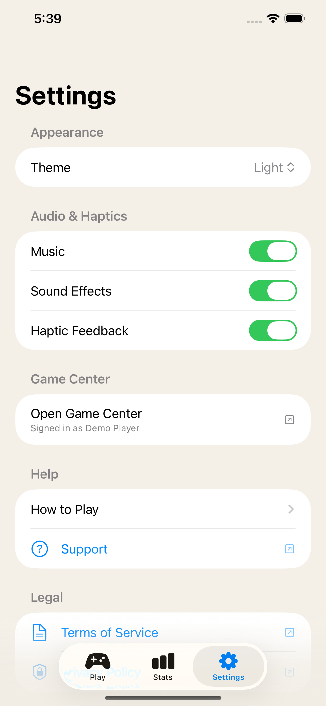 |

### iPad

| Choose Mode | In-game | Stats |
| :---------: | :-----: | :---: |
| 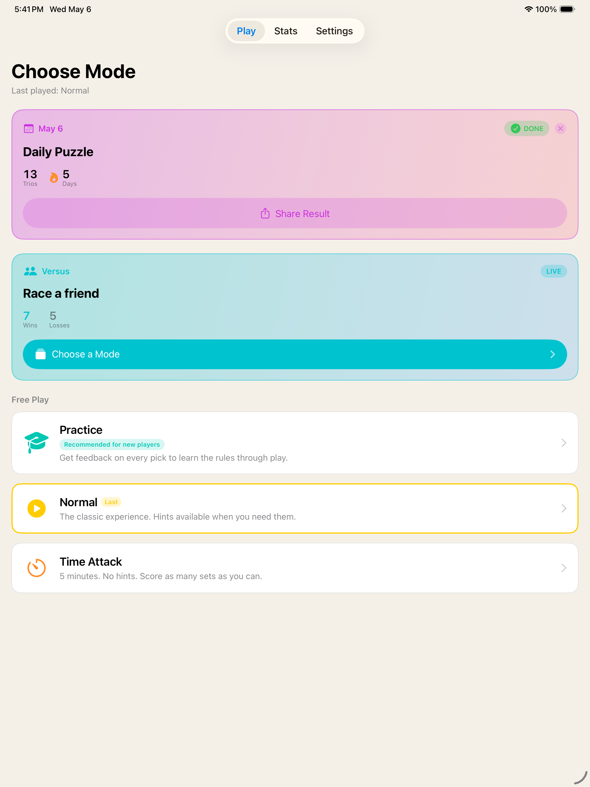 | 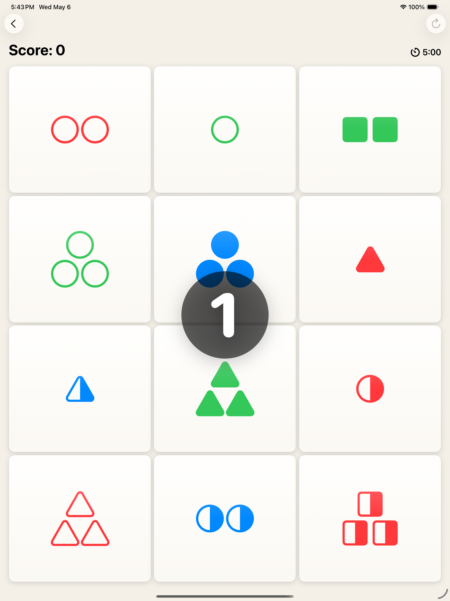 | 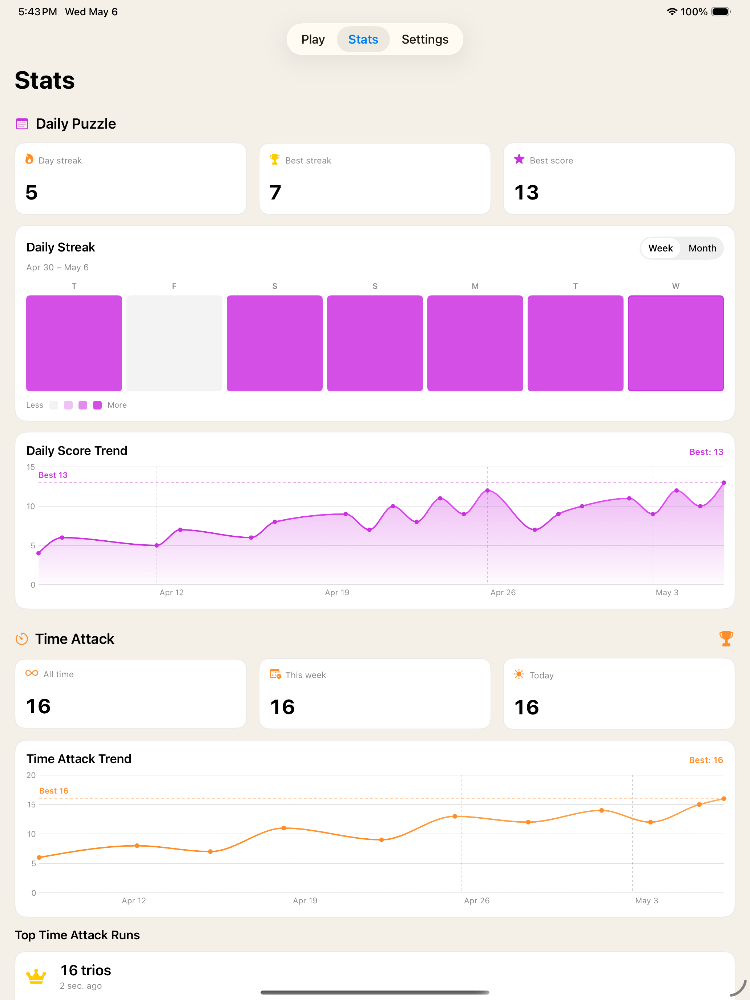 |

| Versus Picker | First to 10 | Settings |
| :-----------: | :---------: | :------: |
| 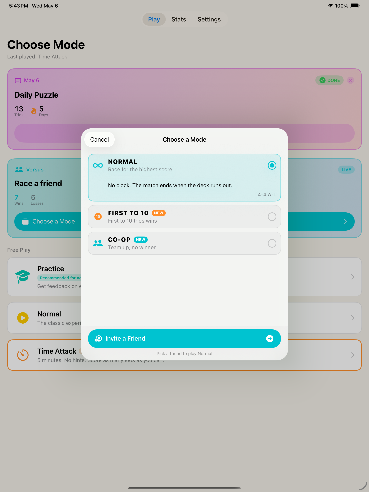 | 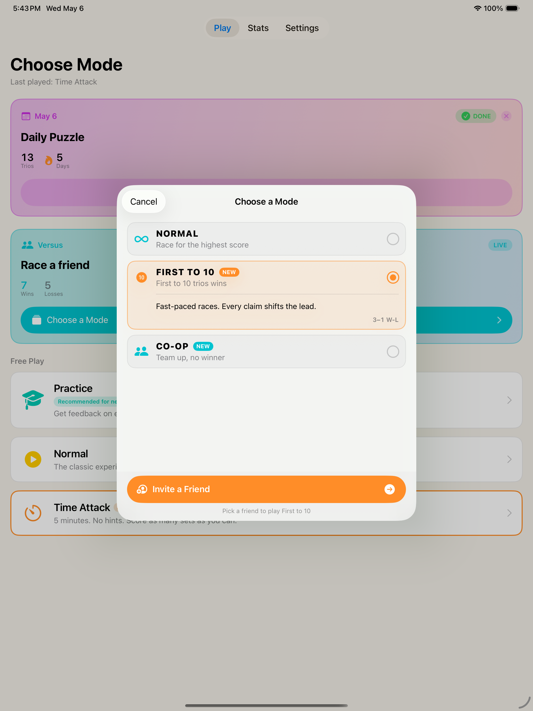 | 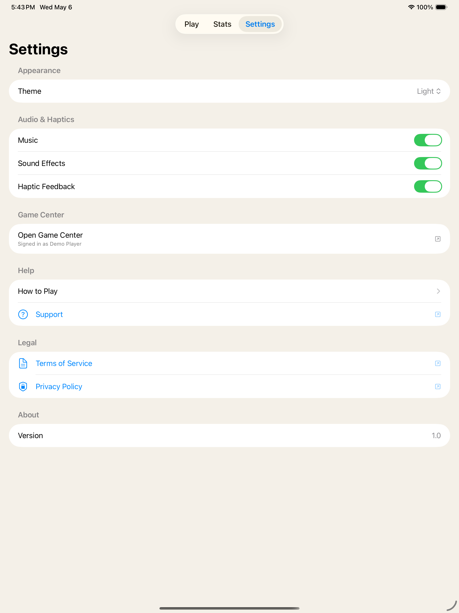 |

---

## What you do

Each card has four attributes: **shape**, **count**, **color**, and **fill.**

A trio is valid when, for **every** attribute, the three cards are either:

- **all the same**, or
- **all different**

That's the whole rule. Your eyes will fight you anyway.

---

## Modes

### 🎓 Practice
Get instant feedback on every pick. Tertia tells you exactly *why* a trio works or doesn't — attribute by attribute, in plain language. The idle hint quietly highlights two cards from a valid trio when you've been staring too long. The fastest way to internalize the rules.

### ▶️ Normal
The pure experience. Take your time. Use a hint when you're stuck. Deal three more when the board has nothing.

### ⏱ Time Attack
**Five minutes. No hints. No safety net.** Every match buys you extra seconds and feeds your **combo multiplier** — chain trios together within the window and watch your score multiply. The board glows orange, the time bonus toasts in, and the clock keeps ticking.

### 📅 Daily Puzzle
**The same deck for every player, every day.** Solve at your own pace, then share your result. Miss a day and the streak resets — show up tomorrow and it builds again. A "Done" badge tells you when today's solved; come back at midnight for a fresh shuffle.

---

## What makes it fun

**Combos that actually matter.** Land a valid trio within five seconds of the last one and your multiplier climbs to ×2, then ×3. Your score chip lights up, the board edge glows, and a missed trio breaks the chain. Tertia rewards reading the table, not just clicking.

**A practice mode that teaches.** Most games tell you you're wrong. Tertia tells you *which attribute* is wrong, every time, in plain English ("two filled, one empty"). After a session of Practice, the rules stop feeling like rules and start feeling like a sense.

**Time bonuses you'll chase.** Time Attack drops you with a 5-minute clock, but every match adds seconds. Strong players can extend a run a long way past the buzzer. The toast pops in next to the timer and the seconds physically tick up — it's the best kind of greedy.

**A streak you don't want to break.** The Daily Puzzle remembers. The flame icon sits next to your day count. Tomorrow's puzzle is already waiting.

**It feels like an iOS app.** Custom haptics on every important moment, considered sound design (silenceable from Settings), animated dealing, smooth card transitions, and a clean light/dark adaptive look that follows your system.

---

## Features

- ✅ Four distinct modes (Practice, Normal, Time Attack, Daily Puzzle)
- ✅ Combo multiplier system (×1 → ×2 → ×3) with a 5-second window
- ✅ Time-bonus seconds awarded for chained trios in Time Attack
- ✅ Practice mode verdict bar — explains every trio attribute by attribute
- ✅ Idle hint halo in Practice (passive, never intrusive)
- ✅ Per-day puzzle that's identical for everyone, with shareable results
- ✅ Persistent daily streak, with grace for the puzzle you finish at 11:59
- ✅ Local high-score tracking and best-time stats
- ✅ Fastest-trio and longest-combo callouts on every game-over sheet
- ✅ Full VoiceOver labels and Reduce Motion support
- ✅ Haptics, music-aware sound effects (toggle either off in Settings)
- ✅ Light + dark mode, with a system-follow option
- ✅ Universal iPhone & iPad layout

---

## What it's like to play

The first time you sit with Tertia, you'll click random combinations and miss. Practice mode walks you through *why*, attribute by attribute, until the rules click. Then you'll move to Normal and start finding trios in three or four seconds. Then you'll try Time Attack and discover that "knowing the rules" and "spotting trios under a clock" are very different skills.

A week in, the Daily becomes a ritual. Two minutes with coffee. Build the streak.

---

## Tips for getting better

- **Pick an attribute first.** Stop looking at "the cards" and start looking at "all the red ones," or "all the striped ones." Your brain handles one dimension at a time.
- **Use Practice as a warm-up.** Even strong players misread an attribute now and then. The verdict bar will show you which one.
- **Combos snowball in Time Attack.** Two quick trios are worth more than two slow ones. Don't get greedy on a hard scan when an easy trio is sitting there.
- **The board with no trio is a real thing.** When Tertia tells you to **Deal 3**, trust it.

---

## Requirements

- iPhone or iPad running iOS 26.2 or later
- That's it.

---

## Acknowledgements

Tertia is an independent pattern-matching card game inspired by classic shape-attribute deduction puzzles. It is not affiliated with, endorsed by, or sponsored by any other card-game brand. Sound effects courtesy of [Mixkit](https://mixkit.co/free-sound-effects/).
